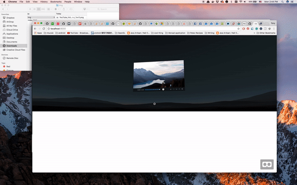

# SketchWebVR
The Sketch plugin is to help designers export their UI designs into webVR scene rapidly. The plugin currently exports each artboard as an image and then import them into the webVR scene.
Designers can decide the depth of the artboard by renaming the artboard name with the following approach.

### Scale
When increasing distance, designers usually would like to scale their UI elements to maintain the same interaction area. The plugin follows the measurement unit, **dmm**, proposed by Google Daydream Team on Google I/O 2017 ([intro](https://youtu.be/ES9jArHRFHQ)), so the plugin will adjust the size of the element based on the distance you set up.

### Installation
1. Download Zip and Extract it. There’s a demo sketch file and a SketchToVR.sketchplugin.
2. Double click on SketchToVR.sketchplugin. Sketch will install the plugin.

### Configure the Distance
You just need to append the depth in this format: [name]-z_[number]e-[power of 10]. For instance, in the following gif, the original name of the artboard is "YouTube_Video Player". We can rename it as "YouTube_Video Player-z_1e-0", which means we would like to place it at z = 1 * (10^0) = 1.0.

### Export mocks with the plugin
1. Select on an artboard you would like to export.
2. Go to Plugins > vrui > export.

### View your design on the browser
1. The export folder, _sketch-webVR_, will be placed at the same folder as your sketch design file.
2. It needs a local server to work, so you can upload the folder to your own server, or run a [SimpleHTTPServer](http://www.scottmadethis.net/interactive/simpleserver/).
3. You can open the `localhost:8000` on your browser.
4. If you would like to preview on your mobile devices, make sure your computer and mobile device are connecting to the same LAN first. Secondly, open `ip-address-of-your-computer:8000` on your mobile phones. ([instruction](http://osxdaily.com/2010/11/21/find-ip-address-mac/) to get your local ip address on Mac)

### Feature Roadmap
Currently, it is the initial prototype. I'd like to hear feedback from everyone to understand what kind of features you would like. For instance, you would like to export UI elements in 3D instead of an 2D image, etc. Here is a list of bullets I would like to add:
1. Export each group in Sketch as an element into VR scene.
2. Can mock on the box, circle, and some basic 3D geometries.

### Credits
- Sketch-to-VR: https://github.com/auxdesigner/Sketch-to-VR
- SimpleHTTPServer: http://www.scottmadethis.net/interactive/simpleserver/
